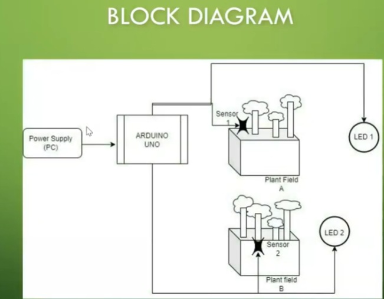
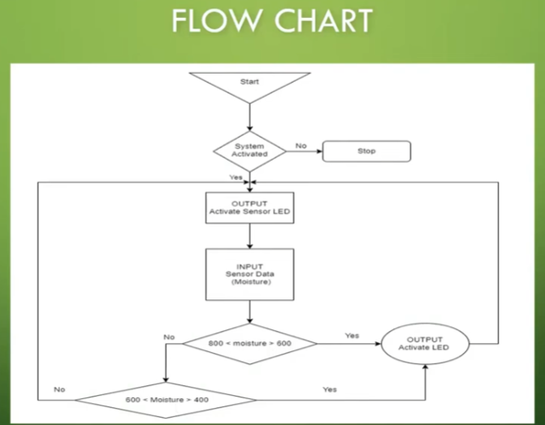
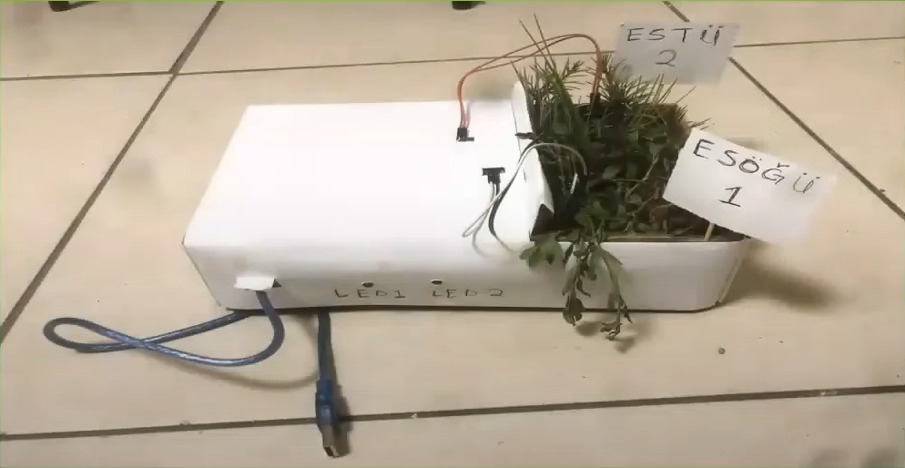

## Moisture-Triggered Automated Signaling System
Video Demonstration: [View Prototype on YouTube](https://www.youtube.com/shorts/j1PzWgGFSKA)

**Project Overview**

This project is a foundational hardware prototype developed to evaluate the efficacy of analog moisture sensors for agricultural water management. Designed with the agricultural economy of Tanzania in mind, the system provides binary visual feedback to optimize manual irrigation control. By replacing guesswork with empirical soil data, the prototype serves as a proof-of-concept for localized water conservation efforts.

**System Architecture**

The system operates as an open-loop indicator relying on continuous environmental sampling.

* **Input Stage:** Analog signals from resistive soil moisture sensors are sampled via the integrated Analog-to-Digital Converter (ADC) on the microcontroller (Pins A1, A2).

* **Processing:** The firmware evaluates these continuous voltage signals against empirically derived calibration thresholds.

* **Output Stage:** Upon satisfying the programmed logic conditions (moisture dropping below optimal levels), the microcontroller drives digital output pins (D4, D5) to trigger local LED indicators. This provides immediate, real-time state feedback, signaling the necessity for physical intervention.

**Hardware Reality (BOM)**

The physical prototype was built with a focus on cost-effective, accessible components housed in a custom enclosure:

* **Microcontroller:** Arduino Uno (ATmega328P)

* **Sensors:** 2x Analog Resistive Soil Moisture Sensors

* **Indicators:** 2x LEDs (for discrete zone signaling)

* **Infrastructure:** Solderless breadboard, standard jumper wires, custom physical housing for dual plant fields

* **Power Distribution:** 5V DC (supplied via USB interface)

**Challenges & Debugging**

**Issue: Sensor Non-Linearity and Signal Drift**

The initial integration revealed that the budget-friendly resistive sensors exhibited significant non-linearity. Relying on standard or theoretical threshold values resulted in erratic signaling and false triggers.

**Troubleshooting & Validation Steps:**

1. **Data Logging:** Initiated continuous serial monitoring of the ADC values to observe how the sensors reacted in real-time.

2. **Environmental Validation and Testing:** Subjected the sensors to highly controlled, iterative physical tests. I manually adjusted the hydration levels of the specific soil being used and mapped the corresponding hardware response curves.

3. **Firmware Calibration:** Discarded theoretical parameters and updated the firmware with empirically validated threshold bands (e.g., locking the activation window strictly between the analog values of 600-800). This manual validation stabilized the logic loop and ensured reliable field operation.

**Resourcefulness & Rapid Prototyping**

To accelerate the deployment of this prototype, foundational open-source firmware was sourced and structurally modified to fit the specific pinout, logic requirements, and calibration constraints of this build. By leveraging existing boilerplate code for standard I/O operations, I was able to dedicate the majority of the project timeline to what matters most in systems engineering: physical hardware integration, environmental calibration, and robust system validation.

**Future Expansion & Automation Roadmap**

To evolve this prototype from a signaling device into a fully autonomous, closed-loop system, the following architectural upgrades are planned:

* **Actuator Integration:** Implementation of an electromechanical relay module to control a 12V DC water pump, replacing manual watering with automated actuation based on sensor states.

* **Algorithmic Complexity:** Expanding the firmware to account for varying soil porosity metrics and plant-specific hydration profiles.

* **Hardware Upgrades:** Transitioning from resistive sensors to capacitive soil moisture sensors to prevent galvanic corrosion and ensure long-term, buried deployment reliability.
